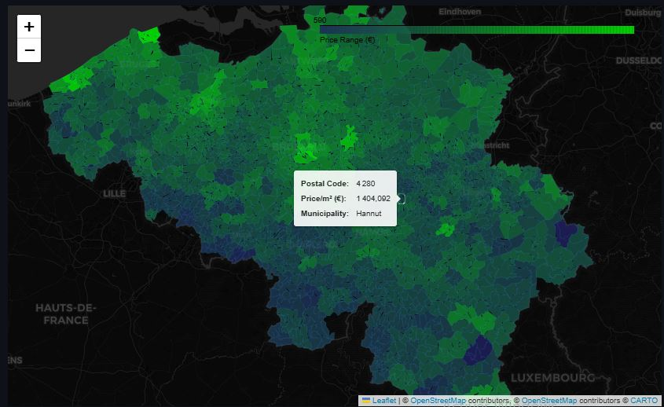
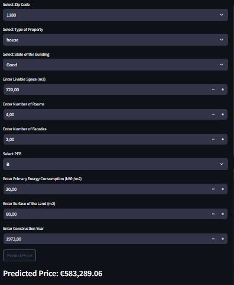

# Immo Belgium App

## Description

The Immo Belgium App is a real estate prediction tool designed to analyze property data and provide insights into the Belgian real estate market. Using advanced machine learning models and interactive visualizations, it predicts property prices and offers users valuable tools for informed decision-making in the real estate domain.

Key Highlights:
- **Predictive Analytics**: Get accurate property price predictions based on market trends.
- **Data Visualization**: Interactive charts and graphs for deeper insights into market behavior.
- **Deployed on Streamlit**: Seamless and responsive web application experience.

---

## Installation

1. Clone the repository:
   ```bash
   git clone https://github.com/Dadelidodu/immo_belgium_app.git
   ```
2. Navigate to the project directory:
    ```bash
    cd immo_belgium_app
    ```
3. Install the dependencies:
    ```bash
    pip install -r requirements.txt
    ```
## Usage

1. Run the app locally:
    ```bash
    streamlit run main.py
    ```
2. Open the displayed URL in your browser.
3. Explore real estate trends and predict property prices interactively.

## Online Access

The app is deployed on Streamlit and can be accessed directly here: https://immobelgium.streamlit.app/

## Visuals

Example Interface



Sample Prediction Output




## Contributors
David: End to end contribution to the project
We welcome contributions! Feel free to open issues or submit pull requests to help improve this app.

## Timeline
November 2024 : Official launch
December 2024: Deployment of the app

## Personal Situation
This project was inspired by a need to understand real estate trends in Belgium and provide accessible tools for market analysis. Whether you're a first-time buyer, a seasoned investor, or just curious about the market, this app offers something for everyone.

## Project Structure
    ```bash
    .
    ├── .devcontainer/          # Development container configuration
    ├── .streamlit/             # Streamlit app configuration
    ├── Scripts/                # Utility scripts
    ├── data/                   # Dataset files
    ├── main.py                 # Main application entry point
    ├── requirements.txt        # Python dependencies
    └── README.md               # Project documentation
    ```
## Data
The app relies on real estate data stored in the data/ directory. Ensure that the data files are properly formatted and placed in this directory before running the app.

## License
This project is open-source and available under the MIT License.

## Contact
For questions or feedback, contact the project maintainer via the repository issues page.